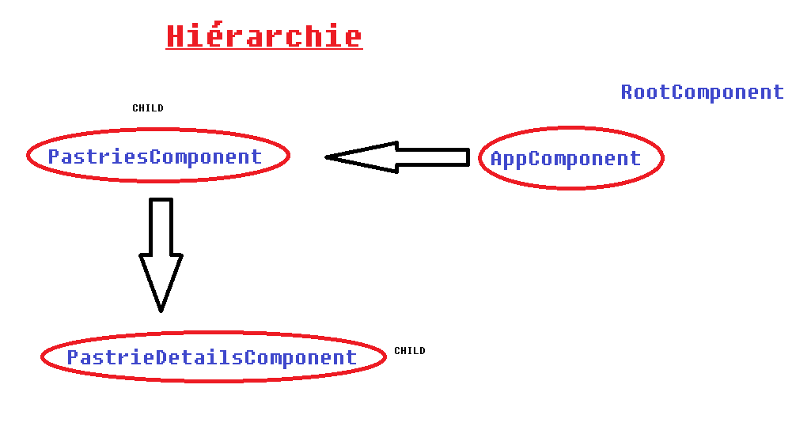
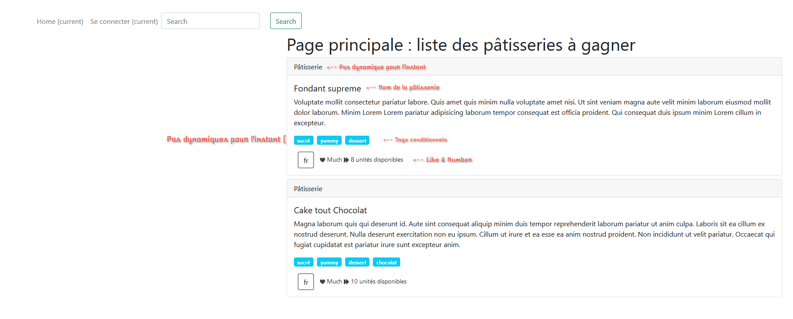

# Introductions aux Components

## Présentation

Nous allons créer deux Components : `pastries` et `pastries-details`.

Un component est une classe `TypeScript` décorée par le décorateur `@Component`.
Un `component` est associé normalement à son template et à ses CSS, par défaut.

Isolés des autres components.

Nous allons créer deux Components : `PastriesComponent` et `PastrieDetailsComponent`. 

Il faudra voir les components comme des éléments hiérarchiques dans
la page HTML, le component `PastriesComponent` est un enfant du Component
`AppComponent`. Ce dernier est donc le Component racine. 

Notons, mais nous en reparlerons, que ces components sont encapsulés dans l’unique module existant pour l’instant dans notre application : `AppModule`.



### Création du component PastriesComponent

Tapez dans la console la ligne de code suivante, nous utilisons `angular-cli` pour
créer le component :

*La commande classique*

```bash
ng generate component pastries
```

*la même commande peut être écrite de manière plus consise*

```bash
ng g c pastries
```

Vous devriez voir maintenant le dossier pastries créé dans le dossier **src**. Nous allons travailler dans la classe `Component` pour importer les données puis les passer à la vue : template HTML associé.

**Angular** a automatiquement ajouté ce component à son `AppModule`, ouvrez le fichier `app.module.ts` pour vérifier cet import.

```typescript
import { NgModule } from '@angular/core';
import { BrowserModule } from '@angular/platform-browser';

import { AppRoutingModule } from './app-routing.module';
import { AppComponent } from './app.component';
import { PastriesComponent } from './pastries/pastries.component';

@NgModule({
    declarations: [
        AppComponent,
        PastriesComponent
    ],
    imports: [
        BrowserModule,
        AppRoutingModule
    ],
    providers: [],
    bootstrap: [AppComponent]
})
export class AppModule { }
```

## Création des données

Nous allons maintenant créer les données d’exemple, dans un fichier pour l’instant,
pour cela nous allons créer un fichier `pastrie.ts` avec une classe pour définir nos données :

```bash
ng generate class Pastrie
```

Ce fichier est normalement créé à la racine du dossier `src/app`.

## Exercice 9

Créez les attributs de la classe `Pastrie` sachant que nos pâtisseries sont constituées par les éléments suivants dans notre fichier `mock-pastries.ts`:

|   Attribut   |   Type |  information|
|---    |:-:    |:-:  |
|*id*|`string`||
|*ref*|`string`||
|*name*|`string`||
|*description*|`string`||
|*quantity*|`number`||
|*order*|`number`||
|*url*|`string`| Facultatif|
|*tags*|`Array`|Facultatif|
|*like*|`string`|Facultatif|


* Vous devez définir chaque attribut avec son type précis, sans préciser la visibilité (*private*, *public*, *protected*) dans cette classe.

* Récupérez la source des `mock-pastries.ts` que vous placerez dans le dossier `src/app`.

### Importez les données dans le component

Nous allons maintenant importer les données dans le component `PastriesComponent`.

#### Les sélecteurs

Dans le component parent `AppComponent` vous allez placer le sélecteur :

```
    <app-pastries></app-pastries>
```

Il permet d’insérer le component enfant `PastriesComponent`.

Dans le component `PastriesComponent` (fichier `pastries.component.ts`) 
vous trouverez le nom du sélecteur à utiliser dans le component `AppComponent` :

```angularjs
import { Component, OnInit } from '@angular/core';

@Component({
    selector: 'app-pastries',
    templateUrl: './pastries.component.html',
    styleUrls: ['./pastries.component.scss']
})
export class PastriesComponent implements OnInit {

    constructor() { }

    ngOnInit(): void {
    }
}
```

Dans le fichier `app.component.html` vous devez alors mettre votre sélecteur pour « **câbler** » les deux templates **parent** et **enfant** :

```angular2html
<div class="container-fuild principal">
    <nav class="navbar navbar-expand-lg navbar-light">
    </nav>
    <app-pastries></app-pastries>
</div>
```

Vous devriez voir maintenant le message suivant dans la page principale de l’application : 

```
pastries works!
```

Nous allons nous occuper de l’affichage des données à partir du Component `PastriesComponent`. Nous devons importer les données dans ce component.

#### Interpolation

L’interpolation permet de définir des données dans le **TypeScript** que l’on pourra afficher dans le template à l’aide des doubles accolades `{{` . . . `}}`,
c’est du **data-binding one-way** (**TypeScript** vers le template). 

* Créez un titre à la page `titlePage` dans le `PastriesComponent` puis utilisez le dans le template :

```typescript
import { Component, OnInit } from '@angular/core';

@Component({
selector: 'app-pastries',
templateUrl: './pastries.component.html',
styleUrls: ['./pastries.component.scss']
})
export class PastriesComponent implements OnInit {
    titlePage: string = "Page principale : liste des pâtisseries à gagner";
    
    constructor() { }
    
    ngOnInit() {
    }
}
```

* Dans le template `pastries.component.html` écrivez :

```angular2html
<h1>{{ titlePage }}</h1>
```

### Affichage des données pastries

Il faut maintenant importer les données et le type `Pastrie` dans le component `PastriesComponent`, voyez le code suivant, le fait d’appeler `PASTRIES` directement dans l’attribut `pastries` permet la récupération de toutes les données :

```angularjs
import { Component, OnInit } from '@angular/core';

// Importez la définition de la classe et les pâtisseries
import { Pastrie } from '../pastrie';
import { PASTRIES } from '../mock-pastries';

@Component({
    selector: 'app-pastries',
    templateUrl: './pastries.component.html',
    styleUrls: ['./pastries.component.scss']
})
export class PastriesComponent implements OnInit {
    
    titlePage: string = "Page principale : liste des pâtisseries à gagner";
    pastries: Pastrie[] = PASTRIES;
    
    constructor() { }
    
    ngOnInit() {
    }
}
```

## Exercice 10

* Vous allez maintenant afficher la liste des différentes pâtisseries.

La directive structurelle `*ngIf` permet d'effectuer un test conditionnel sur une variable afin d'afficher ou non le code HTML sur lequel elle est attachée.  

La directive structurelle `*ngFor` permet d'effectuer une boucle conditionnelle sur l'une des balises HTML auquel elle est attachée. 


Voici un exemple d'utilisation des directives structurelles `*ngIf` et `*ngFor`

```angular2html
<ul *ngIf="pastries" class="list-inline">
    <li class="list-inline-item" *ngFor="let pastrie of pastries">
        <span class="badge badge-info">{{ pastrie.id }}</span> {{ pastrie.name }}
    </li>
</ul>
```

Ce bout de code test l'existence de la viarable `pastrie` puis, affiche autant de bloc `li` qu'il y a de `pastrie` dans le tableau `pastries`.


* Afficher le **like** de la pâtisserie.

Vous utiliserez la directive `*ngIf`. Reportez-vous à la documentation en ligne : *documentation directives*.

* Faites la même chose avec le nombre de pâtisseries.

* Affichez les **tags**.

Le résultat final attendu devrait ressembler à cela : 

